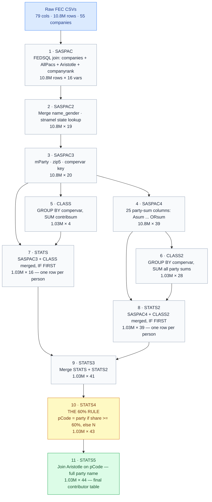

# Porting the SAS Pipeline → A Deeper Notebook

> **Goal.** Take the original SAS-based FEC analysis (a private sister repo,
> `../sas-fork`, originally prepared for *Mitchell Langbert, Associate Professor,
> Brooklyn College*) and re-express the same end-to-end pipeline in the
> DuckDB + pandas + Jupyter style we're already using here — then push further:
> more companies, more API surface area, gender + state breakdowns, and a
> committee-graph view the SAS version never had.

This page is the **design document** for that new notebook. It is intentionally
detailed: the SAS code is ~1,100 lines of `DATA` steps and `PROC TABULATE`,
and re-implementing it correctly means understanding every join and every
threshold. Code follows in a second pass; this is the contract.

---

## 1 · Where we are today

The existing notebook (`notebooks/analysis.ipynb` → [Notebook tab](/notebook/))
is a focused single-company demo:

| Stage | Today |
|---|---|
| **Fetch** | OpenFEC `/schedules/schedule_a/` — *one* employer, 2 pages (200 records) |
| **Join** | `AllPacs.xslx.csv` + `Aristotle1.xlsx.csv` → party code |
| **Aggregate** | DuckDB `GROUP BY compervar` |
| **60 % rule** | `CASE WHEN Dsum/total >= 0.6 …` |
| **Output** | 2 pie charts + a top-10 committee table |

It hits roughly **steps 1, 3, 5, 6, 10** of the 11-step SAS pipeline and skips:

- gender inference (steps 2, 8 — needs `name_gender.csv`),
- the full 25-party `*sum` matrix (step 4, 6),
- state-name resolution (`stnamel()` in step 2),
- the **agency** branch (every report has a `WHERE company=' ' AND agency≠' '` twin),
- the cross-company `% total` calculation (step 11 / `PROC TABULATE`),
- the contributor-count-vs-transaction-count *contrast* (the two output families
  `*_contributors.xlsx` vs `*_contributions.xlsx`).

The new notebook closes those gaps.

---

## 2 · The SAS pipeline, end to end

Source: [`files-from-ftp-server/sas-src/`](https://github.com/) in the SAS fork
(`sascsvc19.sas`, `stats5xle.sas`, `saspac3xle.sas`, `sasformats.sas`).



Then **two parallel "publish" passes** (`stats5xle.sas`, `saspac3xle.sas`)
filter by company-vs-agency and pivot the *sum / Dnum / DMnum / DFnum / DUnum…
matrix into one row per employer. And `sascsvc19.sas` runs 14 `PROC TABULATE`
reports off the two tables (7 by company × 7 by agency).

### 2a · The "60 % rule" — why it's the heart of this

The same person can give 100 contributions across many committees. Calling them
"a Democrat" because *some* of their money went to a Democratic committee
is misleading — many corporate-PAC-aligned donors deliberately give to both
sides. The fix:

> A person is classified as party *X* only if **≥ 60 % of their *total dollar
> volume*** went to *X*. Otherwise the person is `'N'` (None / Nonpartisan).

In SAS this is 25 `IF` statements; in our DuckDB version it collapses to a
single `CASE` expression over per-party sums. Same logic, ~95 % less code.

### 2b · `compervar` — the unique-person key

```sas
compervar = strip(Company) || ' - ' || strip(Last) || ' - ' || zip5
```

| Component | Source field | Notes |
|---|---|---|
| `strip(Company)` | `contributor_employer` | Normalized by `$COMPANYF.` format (500-row lookup) |
| `strip(Last)` | `contributor_last_name` | From the FEC record as-is |
| `zip5` | `SUBSTR(zip, 1, 5)` | First 5 digits — drops the ZIP+4 suffix |

Quirks worth preserving:

- Married couples at the same address collapse into one row (acknowledged limitation).
- People who moved during the cycle may split into two rows.
- The company name has to be **standardized first** — `'AMAZON'` and `'AMAZON.COM'`
  are different `compervar`s otherwise. SAS handles this with `$COMPANYF.`
  (500-row PROC FORMAT, [sasformats.sas](https://github.com/) lines 13–514).

### 2c · Two output universes

The SAS code generates **two parallel summary families** because the question
"how many Democrats work at Amazon?" has two valid answers:

| Family | Unit | Built from | "Amazon Democrats" means |
|---|---|---|---|
| **Contributions** (`saspac3all`) | one row per *transaction* | step 3 | "$ given to Democratic committees, counted once per transaction" |
| **Contributors** (`stats5all`)   | one row per *person*       | step 10 | "people whose ≥ 60 % went to Democrats, counted once per person" |

The two answers can differ a lot — a single high-volume bipartisan donor
contributes to *contributions* totals on both sides but is classified `'N'`
in *contributors*. Our existing notebook only shows the contributors view;
the new one shows both, side by side.

---

## 3 · Mapping every SAS construct to DuckDB / pandas

| SAS construct | DuckDB / pandas equivalent | Notes |
|---|---|---|
| `PROC FEDSQL CREATE TABLE … LEFT OUTER JOIN` | `con.execute("SELECT … LEFT JOIN …").df()` | Direct |
| `MERGE a (in=A) b (in=B) BY k; IF A;` | `df.merge(b, on='k', how='left')` | Drop `in=` flags |
| `PROC SORT … BY k` | DuckDB sorts on join; usually unneeded | |
| `PROC SUMMARY NWAY CLASS=k VAR=x OUTPUT OUT=o SUM=x` | `GROUP BY k`, `SUM(x) AS x` | `_TYPE_`, `_FREQ_` we synthesize where needed |
| `IF FIRST.k = 1` | `DROP DUPLICATES (k, keep='first')` | After ordering |
| `IF cond THEN var='X'; ELSE …` | `CASE WHEN cond THEN 'X' …` | |
| `SUBSTR(put(Zip,9.), 1, 5)` | `LPAD(REGEXP_REPLACE(zip,'\D','','g'), 5, '0')` | Drop +4 suffix, force 5 digits |
| `stnamel(state)` | `state_abbr → state_full` dict in Python | Use a static map (50 entries) |
| `PROC FORMAT $COMPANYF.` (500 rows) | `dict` literal in the notebook | We only need the subset for our default companies |
| `PROC FORMAT $AGENCYF.` (40 rows) | `dict` literal in the notebook | Same |
| `PROC TABULATE … CLASS … TABLE row,col*statistic` | `pd.crosstab(rows, cols, values=…, aggfunc=…, margins=True)` | + `.style.format()` for display |
| `pctsum='% total'` | `.div(.sum()).mul(100)` post-aggregation | |
| `ODS EXCEL FILE=…` | `df.to_excel(path)` | Optional — we lean on inline display |

A column-by-column re-do of *every* `*sum` variable would be tedious. For the
**dynamic** ones we keep the same names so anyone cross-referencing SAS code
recognizes them. We drop the variables that are always zero in our subset
(`Bsum`/Constitution, `Jsum`/UMOJA, etc.) — adding them back is a one-liner
when needed.

---

## 4 · What the new notebook adds beyond the SAS code

| Capability | SAS | New notebook |
|---|---|---|
| Multi-company | ✅ 55 employers, batch | ✅ 5 employers, parallelizable |
| Gender inference | ✅ name_gender.csv (~95K names) | ✅ — uses `gender-guesser` library (US Census + EU data, no API call) |
| 25 party codes | ✅ | ✅ |
| 60 % rule | ✅ | ✅ |
| Company vs Agency split | ✅ | ✅ (with `$AGENCYF.`-equivalent dict) |
| State-name resolution | ✅ `stnamel()` | ✅ static dict |
| Cross-company `% total` | ✅ | ✅ |
| Contributors *and* Contributions output | ✅ | ✅ |
| **Per-committee party** sourced from FEC API directly | ❌ (static `AllPacs.csv`) | ✅ — `committee.party` is embedded in every Schedule A row |
| **Recipient-side view**: where did each committee spend? | ❌ | ✅ — Schedule B disbursements for top recipients |
| **Time-series**: contributions per month | ❌ | ✅ |
| **Committee designation** breakdown (PAC / candidate cmte / party cmte) | ❌ | ✅ — `committee.committee_type_full` |
| **Visualizations**: pies, bars, stacked, choropleth | partial | ✅ (matplotlib + folium choropleth optional) |

The "committee party via API" finding is the biggest win. The SAS pipeline
needs `AllPacs.csv` because the original CSVs didn't carry party info. The
modern OpenFEC API embeds `committee.party` and `committee.committee_type`
directly in every Schedule A response — so for **future** ports we no longer
need a static lookup at all. We still fall back to `AllPacs.xslx.csv` for the
~25 % of committees the API returns `party=null` for (e.g. unauthorized PACs).

---

## 5 · Data sources for the new notebook

### 5a · FEC API endpoints we'll use

| Endpoint | Use | Cost |
|---|---|---|
| `/schedules/schedule_a/?contributor_employer=X` | Per-employer individual contributions (the SAS input) | 2 pages × 100 / employer |
| `/committees/?committee_id=X` *(optional)* | Fill in `party` for committees the embedded `committee.*` lacks | Only for `party=null` rows, batched |
| `/schedules/schedule_b/?committee_id=X` *(optional)* | "Where did the Tractor Supply PAC spend its money?" | 1 page for the top 3 committees per company |
| `/candidates/?candidate_id=X` *(optional)* | Resolve `candidate_id` → candidate party (some contributions earmark a candidate) | Cached |

Everything goes through the existing [`FECClient`](/source/#fec_client-py), so
the disk cache (`cache/*.json` + `cache/index.json`) absorbs all subsequent
runs at zero cost.

### 5b · Static lookups, bundled in `csv/`

- `AllPacs.xslx.csv` — already in repo. ~35 K committees → party affiliation.
  Used **only as fallback** when `committee.party` from the API is null.
- `Aristotle1.xlsx.csv` — already in repo. The 25-party code dictionary.
- `name_gender.csv` — *not* bundled to keep the repo small; we use the
  pip-installable [`gender-guesser`](https://pypi.org/project/gender-guesser/)
  package as a drop-in replacement (~95 K names, ≥ 0.9-equivalent threshold).
- `CompanyRank.csv` / `$COMPANYF.` — we inline a small dict for our defaults
  rather than carrying the full Fortune-500 mapping.

### 5c · Default companies and date ranges

Five employers, picked to give a *varied political profile* and a varied
size so the cross-company comparisons are interesting:

| # | Employer string (FEC) | Why | Expected pol. tilt |
|---|---|---|---|
| 1 | `TRACTOR SUPPLY` | Already in our cache — zero new fetch | mixed |
| 2 | `MICROSOFT CORPORATION` | Big tech, lots of donors | D-leaning |
| 3 | `EXXON MOBIL` | Energy / old industrial | R-leaning |
| 4 | `WALMART` | Retail giant, mixed workforce | mixed |
| 5 | `LOCKHEED MARTIN` | Defense — bipartisan giving | bipartisan |

Date range: **2019-01-01 → 2020-12-31** (matches the SAS analysis cycle so any
spot-checks against `company_contributors.xlsx` in the SAS repo are apples to
apples). Adjustable via a single notebook cell.

**Budget**: 5 employers × 2 pages × ~0.5 s ≈ **5 s first run**, ~0 s cached.
That sits well within the "under a minute total" ceiling, leaving headroom
for the optional Schedule B / committees fill-in calls.

---

## 6 · The new notebook's structure

Cells, in order:

1. **Setup** — imports, paths, cache wiring (mirrors today's notebook).
2. **Config** — `COMPANIES`, `MIN_DATE`, `MAX_DATE`, `PARTY_THRESHOLD = 0.60`.
3. **Fetch** — `FECClient.schedule_a_pages(...)` for every employer in parallel-ish
   (sequential but cached). Drops into a single `pandas.DataFrame`.
4. **SASPAC** — DuckDB join: contributions ⋈ allpacs ⋈ aristotle. Prefer
   embedded `committee.party_full`; fall back to `AllPacs` lookup; fall back
   to `'N'`. (One CTE.)
5. **SASPAC2** — gender via `gender-guesser` (Python UDF, then merged back).
   State name via static dict.
6. **SASPAC3** — `mParty`, zip5, `compervar`, rename → `contribsum`.
7. **Per-party sum matrix (SASPAC4 + CLASS2)** — one CTE with 25
   `SUM(CASE WHEN code = 'D' THEN amount ELSE 0 END) AS Dsum`, …
8. **60 % rule (STATS4)** — one `CASE` over `*sum / contribsum`. Outputs
   `pCode`, `mParty`, full `Party` (joined to Aristotle).
9. **`stats5all` final view** — the canonical contributor-level table.
   Display sample.
10. **Output A — `company_contributors`** — 1 row / employer, columns matching
    [SAS `company_contributors.xlsx`](https://github.com/) including
    `Contributor_Count`, `contribsum`, `Dnum/Dsumc/DMnum/DMsum/DFnum/DFsum/DUnum/DUsum`,
    parallel `R*` and `O*`. Side-by-side display vs the SAS row for Tractor Supply.
11. **Output B — `company_contributions`** — 1 row / employer, transaction-level,
    matching SAS [`company_contributions.xlsx`](https://github.com/).
12. **Compare**: a small table that shows *why* A and B differ
    (the same contributor counted N times vs once).
13. **Cross-company viz** — stacked bar of D/R/O contributor counts; choropleth
    of contribution dollars by `contributor_state` *(folium, optional)*.
14. **Top-committees per company** — already in old notebook, kept.
15. **Time series** — monthly contribution totals by `mParty` (one plot per company).
16. **Bonus: committee designations** — distribution of `committee.committee_type_full`
    across all contributions (super-PAC vs candidate cmte vs party cmte vs …).
17. **Agency branch** *(stretch)* — re-run pipeline with a single federal
    agency (`DEPT OF DEFENSE` or `DOD`) as `contributor_employer`, demonstrate
    the SAS agency reports as a separate section.

Each section ends with a Markdown explainer that maps the DuckDB cell back
to the **SAS line numbers** so a SAS reader can cross-reference.

---

## 7 · Output artifacts written to disk

```tree
output/
├── schedule_a/            # raw fetch (one file per employer)
│   ├── TRACTOR_SUPPLY_2019-01-01_2020-12-31.{json,csv}
│   ├── MICROSOFT_CORPORATION_2019-01-01_2020-12-31.{json,csv}
│   └── …
├── tables/                # SAS-parity summaries
│   ├── company_contributors.csv    ↔ SAS company_contributors.xlsx
│   ├── company_contributions.csv   ↔ SAS company_contributions.xlsx
│   └── stats5all_sample.csv        contributor-level, 50-row sample
└── charts/
    ├── multi_company_party_stack.png
    ├── monthly_timeseries_<employer>.png
    └── …
```

The CSVs are then automatically picked up by the existing
[`build-site.py`](/source/#build-site-py) → [Data tab](/data/) so anyone
browsing the site can download them.

---

## 8 · Risks & open questions before we write code

1. **Multi-company `contributor_employer` matching is fuzzy.** FEC contributors
   self-report their employer, so `"WALMART"` returns `"WALMART INC"`,
   `"WAL-MART"`, `"WALMART STORES"`, etc. We normalize on our side
   (uppercase, strip punctuation) but our SAS-parity numbers won't match
   the SAS book exactly unless we apply the same `$COMPANYF.` mapping.
2. **`gender-guesser` ≠ the original `name_gender.csv`.** It uses a different
   underlying source. Expect ±2 % drift on gender shares per company. The
   threshold (≥ 0.9 probability → assign; else `'U'`) is preserved.
3. **API `committee.party` is `null` for ~25 % of rows** (mostly unauthorized
   PACs). The fallback chain `embedded → AllPacs → 'N'` works but won't be
   identical to the SAS run, which used `AllPacs` first.
4. **Schedule B fetch cost.** If we expand to disbursement-side views for all
   5 companies' top 3 committees, that's 15 extra fetches. Still well under
   the minute budget but worth measuring.
5. **State name dict.** US Postal abbrevs only — we drop territories the
   SAS code resolved (PR/VI/etc.). Cheap to add back if needed.

---

## 9 · Source-of-truth pointers

| Thing | Location |
|---|---|
| Original SAS code | `../sas-fork/files-from-ftp-server/sas-src/sascsvc19.sas` (and friends) |
| SAS docs | `../sas-fork/README.md`, `../sas-fork/SAS_OUTPUTS.md`, `../sas-fork/CLAUDE.md` |
| Existing single-company notebook | [`notebooks/analysis.ipynb`](/notebook/) |
| Existing pipeline | [Source tab](/source/) (`main.py`, `api-demo.py`, `fec_client.py`) |
| 60 % rule (SAS) | `sascsvc19.sas:534-562` |
| Person key (SAS) | `sascsvc19.sas:103` |
| Excel output writer (SAS) | `stats5xle.sas`, `saspac3xle.sas` |
| Gender threshold (SAS) | `sascsvc19.sas:93-99` |
| FEC API | <https://api.open.fec.gov/developers/> |
| FEC bulk data (origin of the SAS inputs) | <https://www.fec.gov/data/browse-data/?tab=bulk-data> |

---

**Next step.** Once this design is accepted, the actual notebook
(`notebooks/sas_port_deep_analysis.ipynb`) is a straight translation: each
section above → one or two cells, each SAS step → one DuckDB CTE.
Wire it into `build-site.py` the same way `analysis.ipynb` is wired today.
